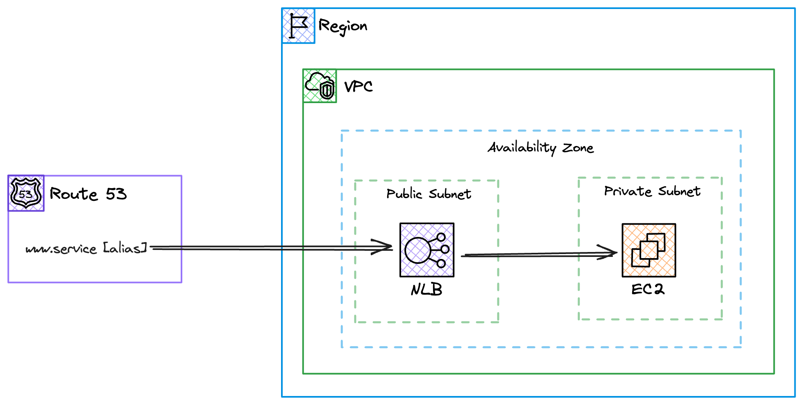
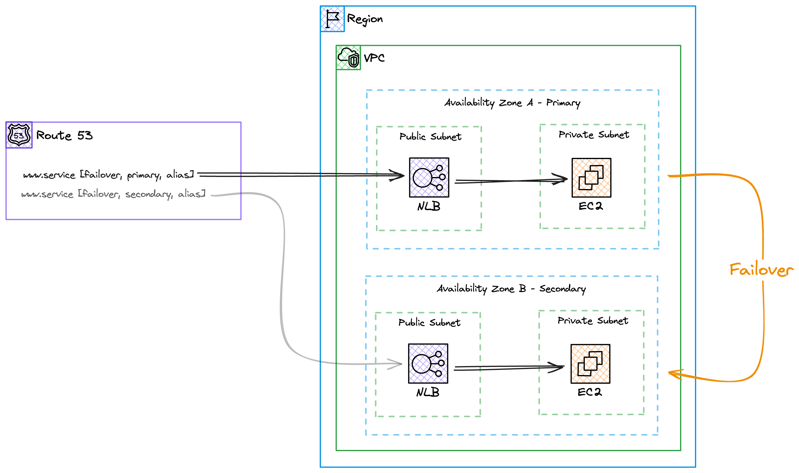
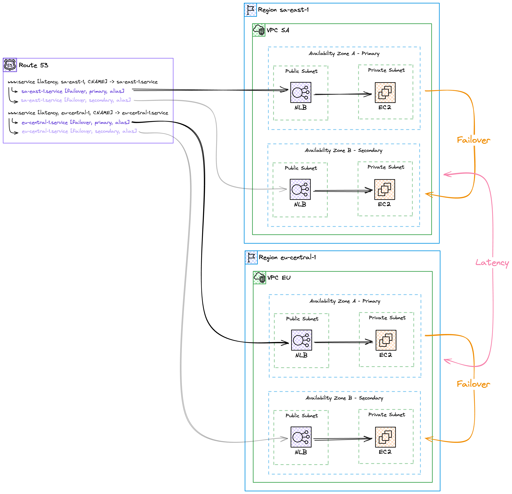
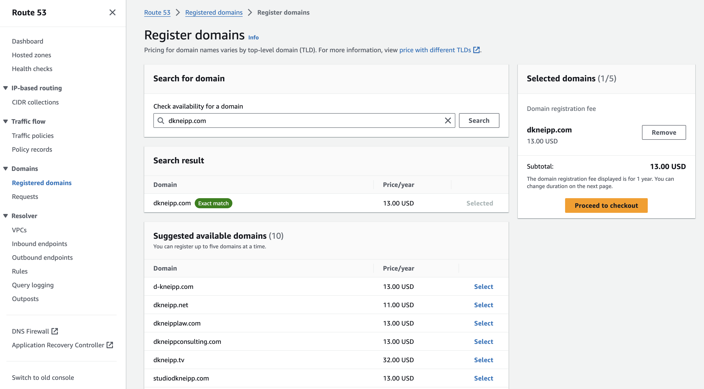
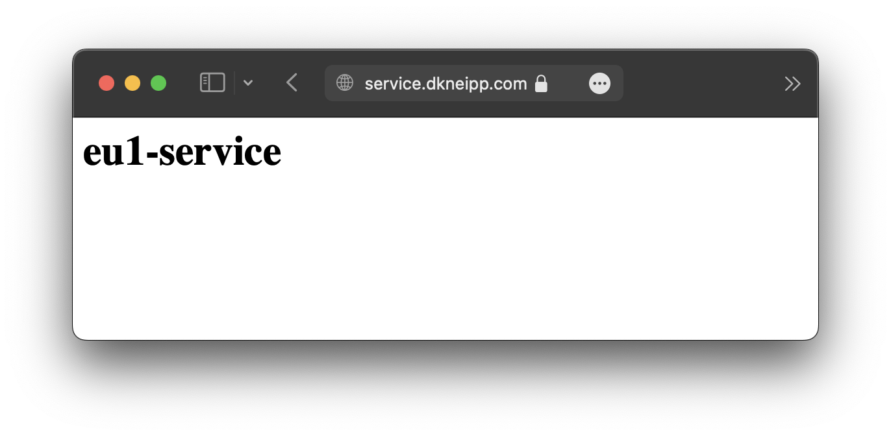
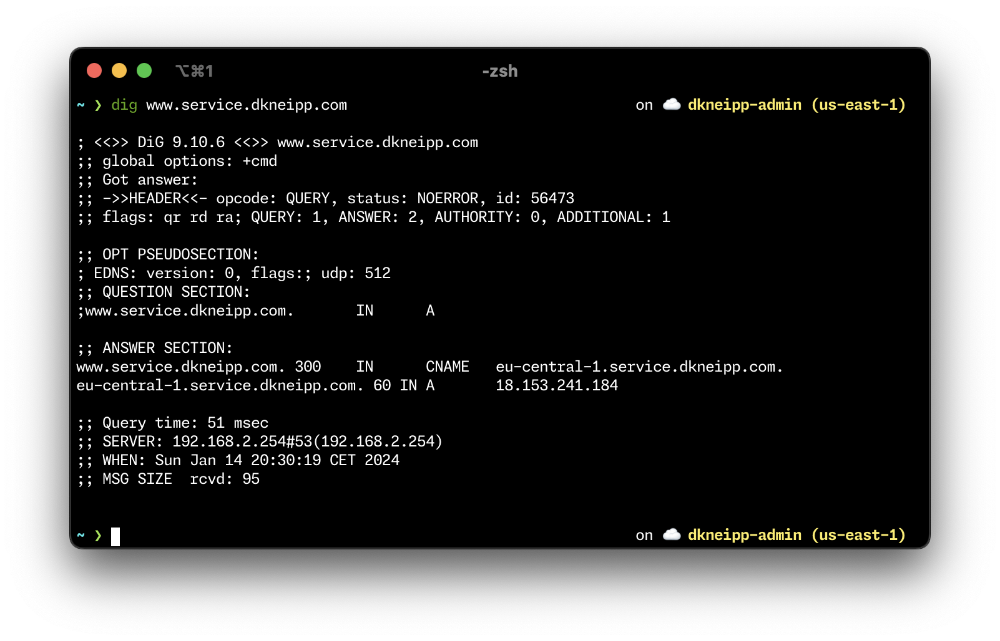
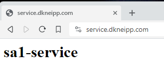
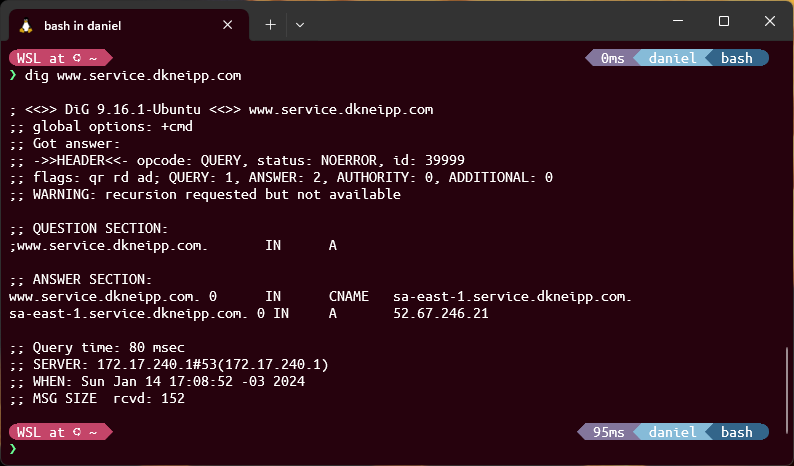
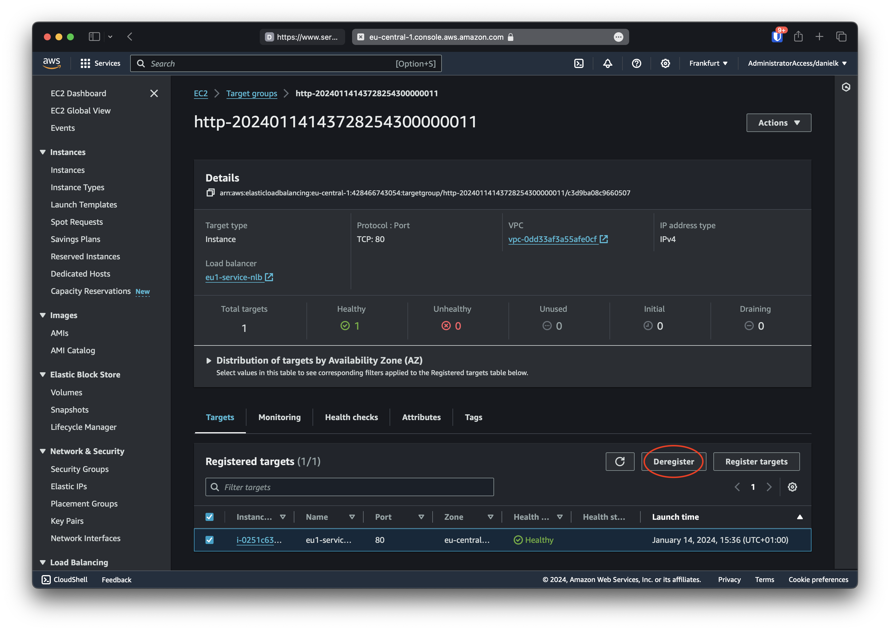
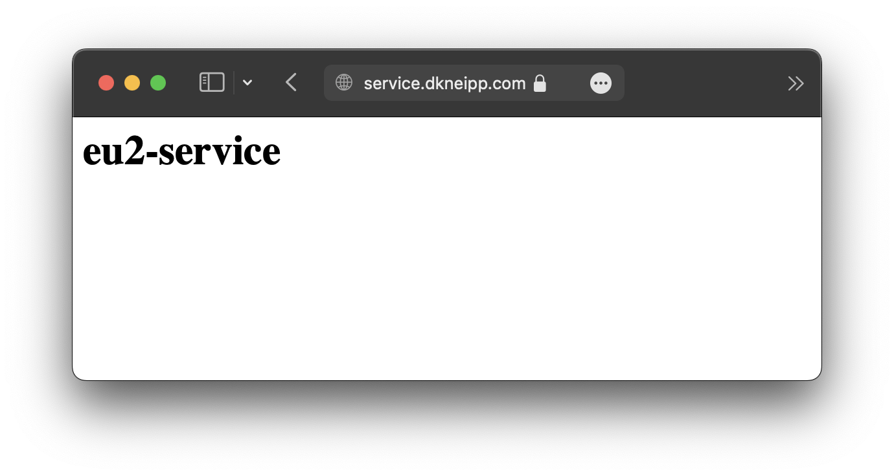

# Global Endpoint For a Multi-region Service

To have a highly available web application requires several components working together. Automated health checks, failover mechanisms, backup infrastructure, you name it. And when it comes to keep response times low globally, the complexity increases even further.

This project presents progressively how to go from a simple application available in the internet, to a full-fledged setup with automated failover, together user traffic segmented per region to keep response times low.

## Progressive Architecture

Here we have three different infrastructure designs of the same service with different levels of complexity.

The first one is a simple erb server running in an EC2 machine.

The second is a more reliable design, with another web server running in passive mode. This second web server would only respond to traffic in case the first one becomes inoperable.

And finally, the last one replicates the previous design in a different region, to provide the same service to a customer base located in a geographically distance place than the previous setup.

### As simple as it gets

This design, as the section implies, is as simple as it gets. Essentially, we have just two-tier application running. We have three main components:

- A DNS record pointing to an [AWS Network Load Balancer (NLB)](https://docs.aws.amazon.com/elasticloadbalancing/latest/network/introduction.html)
- This NLB is deployed on the a public subnet to receive traffic from the internet. This first layer/tier allows the web server to not be publicly exposed to the internet, as well as load balancing between multiple server in case more were available
- And finally we have the web server itself receiving traffic only from the NLB on a private subnet



Everything is deployed on the same [availability zone (AZ)](https://docs.aws.amazon.com/AWSEC2/latest/UserGuide/using-regions-availability-zones.html#concepts-availability-zones), which represents one or more AWS data centers geographically close to each other. This is to ensure fast communication between the load balancer and the web server. This also avoids [costs related to data transfer between AZs on AWS](https://aws.amazon.com/blogs/architecture/overview-of-data-transfer-costs-for-common-architectures/).

The obvious problem with this design is that if the web server becomes out of service, or if the AZ becomes inoperable, the application stops responding to user requests. To overcome this, we will move to the next design.

### Going active-passive

Here we replicate the same infrastructure in a different AZ. The key difference is that this secondary deployment should not receive user traffic unless the primary one stops working. This is also known as an [active-passive deployment](ttps://docs.aws.amazon.com/Route53/latest/DeveloperGuide/dns-failover-types.html#dns-failover-types-active-passive-one-resource).



In this scenario we use AWS Route53 records of type [`failover`](https://docs.aws.amazon.com/Route53/latest/DeveloperGuide/dns-failover-types.html#dns-failover-types-active-passive-one-resource). Those records work in pairs of primary and secondary records. As the name implies, the primary record should point to the server that responds to traffic under normal circumstances.

The secondary DNS record will only take precedence if the primary server is not working properly, or, in other words, it is unhealthy.

*And how can a server be detected as unhealthy?* Using [health checks](https://docs.aws.amazon.com/elasticloadbalancing/latest/network/target-group-health-checks.html). Those can be configured in a way that the load balancer will perform regular checks to confirm if the web server is working properly.

If those checks fail above a certain threshold, the target (the ec2 instance is labeled as unhealthy). If a certain amount of targets are considered unhealthy, the endpoint of the load balancer itself is considered unhealthy.

This status is reported to Route53 (when using records of type `alias`), which uses this information to decides if the DNS requests should be resolved to the secondary load balancer instead, performing the failover.

> ℹ️ We are also making use of making use of the [Availability Zone Affinity](https://aws.amazon.com/blogs/architecture/improving-performance-and-reducing-cost-using-availability-zone-affinity/) architectural pattern to, as mentioned previously, improve response times and reduce [costs](ttps://aws.amazon.com/ec2/pricing/on-demand/#Data_Transfer_within_the_same_AWS_Region). This way, traffic that reaches an AZ never leaves it.

So, now we have a more reliable design with an automated failover mechanism between distinct data centers. However, as a single-region deployment, users in a geographically distant region will suffer with slow response times. Although a [CDN](https://aws.amazon.com/what-is/cdn/) exists for this use case, it is restricted to static assets, not for dynamic APIs.

### Multi-region setup

To achieve a multi-region architecture, while retaining the previous features, the strategy is still the same: replicate the previous design, this time in a different region.

However, in this case, the way to connect the two is via `CNAME` DNS record of type [latency](https://docs.aws.amazon.com/Route53/latest/DeveloperGuide/routing-policy-latency.html).



The records are assigned to different AWS regions and latency is measured between users and AWS regions. The record of the region with the lowest latency is used to resolve the user's DNS requests.

This design is highly available and provides fast response times to users in different regions of the world. Now, it's time to deploy it!

> ⚠️ Note: this design provides resilience against AZ failure, but not regional outage. If the entire region fails, users of that region won't have the service operational.

#### Infrastructure as code

Here we use terraform to allow us to define all the infrastructure via code. This allows us to perform the design replications mentioned previously with relative ease. We can define pieces of the infrastructure as modules and just reuse them as many times as we need.

Here is a brief description of the main directories and files:

```txt
.
├── 📁 regional_domain/ -> Per-region DNS config module
├── 📁 service/         -> NLB + EC2 + web server module
├── 📄 dns.tf           -> Hosted zone and DNS module usage
├── 📄 locals.tf        -> Variables used for replicating server resources
├── 📄 services.tf      -> Loop over the variables to deploy the servers
└── 📄 vpc.tf           -> Network config for public/private subnets
```

The specifications of the service deployments are defined in `./terraform/locals.tf` and, for each region and AZ, a service is defined. As shown below, a public subnet is passed for the NLB, and a private one is passed for the server. The subnets define in which AZ the service will be deployed to.

```tf
sa1 = {
  name           = "sa1-service"
  private_subnet = module.vpc_sa.private_subnets[0]
  public_subnet  = module.vpc_sa.public_subnets[0]
}
```

> The name defines what you will see as a response if that server specifically responds to the request.

Those variables are looped over in `services.tf` by region via `for_each = local.services.<REGION>`. This is a nice example of, when using some terraform features, we can easily replicate infrastructure with next to none code duplication.

`dns.tf` defines which service deployment is the primary and secondary. DNS records are deployed on pairs of primary/secondary via the `regional_domain/` module, together with a record of type latency associated with the region the module is being deployed to.

```tf
elb_target_primary = {
  domain_name = module.services_sa["sa1"].nlb_domain_name
  zone_id     = module.services_sa["sa1"].nlb_zone_id
}
```

Those are the main components of the code. Feel free to dive into the modules to see how they are implemented. Now let's jump into how to deploy this.

#### Deploy

The very first thing need for this demo is a domain name. If you already have one, remember to configure the Registrar of your domain name to use Route53 as DNS server once the infrastructure has been deployed

> In my case, I added the name servers assigned to the Hosted Zone as `NS` records for the `locals.domain_name` on Cloudflare.

And if you don't have one, remember you can also buy one from AWS itself as seen from the image below.



> *Just remember that this will create a Hosted Zone automatically for the domain bought. You will need to change it to make use of the new one that will be created by this project*

In order to run this project you essentially only need terraform. However, I highly suggest to install it via [`asdf`](https://asdf-vm.com/guide/getting-started.html), as it allows you to automate the installation of several other tools and keep multiple version if them installed at the same time.

Once `asdf` is installed, terraform can be installed in its correct version via

```bash
asdf plugin-add terraform https://github.com/asdf-community/asdf-hashicorp.git
asdf install
```

This project obviously also requires that you have properly configured access to your AWS account. If you have configured the credentials using a [file with a profile name](https://docs.aws.amazon.com/cli/latest/userguide/cli-configure-files.html#cli-configure-files-format-profile), the only thing needed is to change the profile name in the `providers.tf` file.

And lastly, change the domain name defined in `locals.tf` to your own.

With that, you can run the following command

`cd terraform && terraform init && terraform apply`

You should see the output:

`Plan: 123 to add, 0 to change, 0 to destroy.`

The deployment of all resources can take from 5 to around 10 minutes.

After all has been deployed, you can already try to reach the service via `www.<DOMAIN-NAME>`, in my case, `www.service.dkneipp.com`.

You should see `sa1-service`, or `eu1-service` depending on the region you are currently in 😉. And from a `dig` command we can also identify which region is responding to the request

| Web UI                                 | DNS Resolution                  |
|----------------------------------------|---------------------------------|
|  |  |

Also, the IP returned by the DNS resolution should match of the NLB of the primary AZ of the region you are closest to.

> 💡 There is only one IP returned because the NLB has only one AZ associated. This ensures the traffic always goes to the designated AZ, unless a failure happens on that AZ.

And by using another computer closest to the other region, we can see the response from that other region

| Web UI                                 | DNS Resolution                  |
|----------------------------------------|---------------------------------|
|  |  |

#### Test failover

In order to test if the failover from one AZ to the other is happening as expected, remove the instance from the target group associated with the primary NLB of the region you want to test. From the image below it can be seen how the instance can be removed



You can also identify the correct target group by checking the listener of the primary NLB. The listener will be forwarding the traffic to the target group that should be changed.

After this, the NLB has no more healthy targets and it is considered unhealthy. This status will be reported to Route53, which will automatically start resolving the DNS requests to the secondary NLB.

Wait for around 2 minutes, and you should be able to see the following while trying to access the same `www.service.dkneipp.com`

| Web UI                                 | DNS Resolution                  |
|----------------------------------------|---------------------------------|
|  |  |

Now, the secondary server is responding to the traffic, as we can identify from the Web UI response, and the fact that the IP of the server changed.

> 💡 Note: since different regions have access to, essentially, different applications, this could be used as a way to promote service upgrades segmented by region

And now, if you add the instance back to the target group of the primary NLB, in a couple of minutes you should see the previous response back again.

#### Cleanup

A simple `terraform destroy` should delete all 123 resources.

## Conclusion

In this project it is shown a step-by-step design evolution from a basic web server available in the web, to a resilient design capable of handling failures in data centers and keep response times low for users in different parts of the globe.

A lot more can still be done, of course, like the use of multiple servers on the same AZ to handle more load or use a microservice approach with Kubernetes or AWS ECS to handle the web server code deployment.

however, the goal of this project is to show some interesting features we can use from AWS Route53 and NLBs in order to have a fast, reliable and cost-effective web server spread in different parts of the world.

### Notes

<details>

<summary>Why <code>www</code> subdomain?</summary>

If you try to access the web server simply via the domain name, you will notice that the DNS request doesn't resolve.

This is because the the `CNAME` records are associated with the `www` subdomain.

This has been done because, by default, Hosted Zones already come with `SOA` records domain apex, and `CNAME` records cannot overlap with `SOA` records.

If you try to deploy a `CNAME` record of `service.<DOMAIN-NAME>`, AWS API will return the following error:

```txt
Bad request.
(InvalidChangeBatch 400: RRSet of type CNAME with DNS name service.dkneipp.com. is not permitted at apex in zone service.dkneipp.com.)
```

</details>
